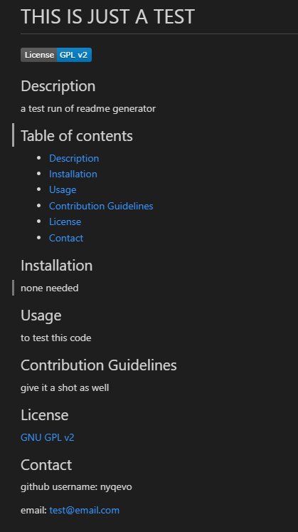

# README GENERATOR

## Description

This project is a simple program using node.js and inquirer package to allow users to make a preformated readme file. It uses inquirer to gather the necessary data for the file and then uses node.js to write the data to a new readme file. This also uses exported functions to keep code modular and easy to understand. This project was made so new users to github or programming in general can have an easy way to generate their readme files and give their future users clear intructions and information on their projects.

## Table of Contents

- README file
- index.js: the core script that is run to begin the process of creating the preformatted readme and gather user data
- utils/generatemarkdown.js: stores the functions used to create the layout of the readme file and dynamically insert given data from the user
- package.json, package-lock.json, node_modules folder: all required packages from npm and inquirer needed for this project to be functional
- test-run-pic.png: just a test run of the program with short sample inputs used

## Links

[Recording of program in use](https://drive.google.com/file/d/1CWLgM_hH8LDNCAaSn3VGP45CxZzRjcOp/view)